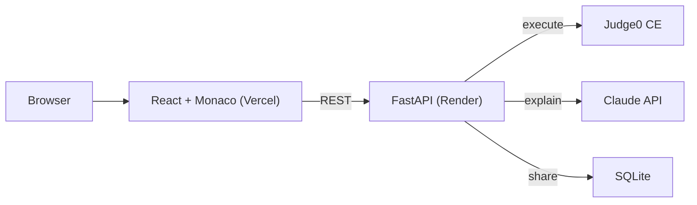

# snippet.run

A browser-based code runner and sharer. Paste code, run it instantly, share a link, or ask Claude to explain it - no install, no account.

**Live:** [snippet-run-jqnq.vercel.app](https://snippet-run-jqnq.vercel.app)

## What it does

- **Run** - execute Python, JavaScript, TypeScript, C, C++, Java, Bash, Go, or Rust directly in the browser
- **Share** - generate a short link to any snippet, instantly runnable by anyone
- **Explain** - get a Claude-powered breakdown of what the code does, streamed in real time

## Why

Most online code runners are either bloated IDEs or ad-heavy snippet sites. snippet.run is built to be fast, minimal, and just useful enough: paste, run, share, done.

## Stack

| Layer | Tech |
|---|---|
| Frontend | React + Vite + Monaco Editor |
| Backend | FastAPI |
| Code execution | Judge0 CE |
| AI explanations | Claude (Anthropic API) |
| Storage | SQLite |
| Hosting | Vercel (frontend) + Render (backend) |

## Architecture



## Running locally

**Backend**
```bash
cd backend
pip install -r requirements.txt
# add ANTHROPIC_API_KEY to .env
python -m uvicorn main:app --reload --port 8000
```

**Frontend**
```bash
cd frontend
npm install
# set VITE_API_BASE=http://localhost:8000 in .env
npm run dev
```

## API

| Endpoint | Method | Description |
|---|---|---|
| `/run` | POST | Executes code, returns stdout/stderr/exit code |
| `/share` | POST | Saves a snippet, returns a share ID |
| `/share/{id}` | GET | Retrieves a saved snippet |
| `/explain` | POST | Streams a Claude explanation of the code |

## License

MIT
